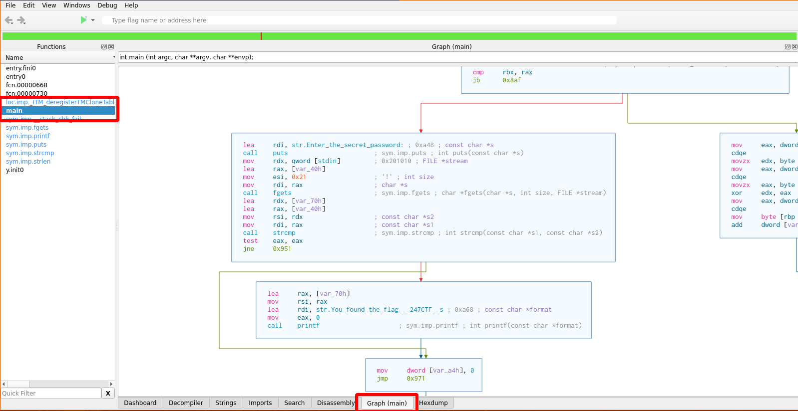
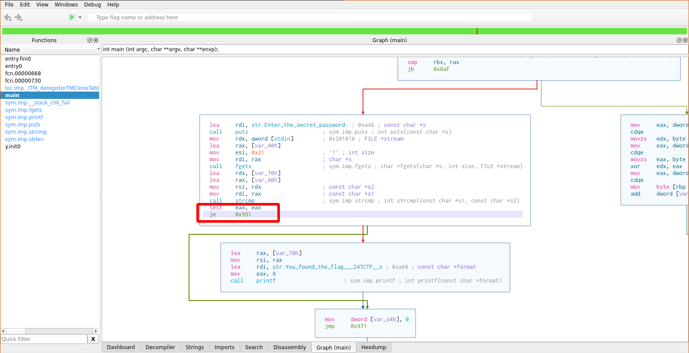
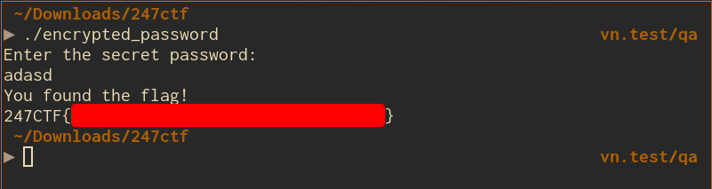

- Install radare2 (CLI) and Cutter (GUI) tools
  - Run Cutter and open `encrypted_password` binary
  - When open binary file, tick in `Load in write mode (-w)`
- Select `main` symbol and `Graph` tab, you can see the basic flow of program

- Here you can see that, stdin input is stored at `[var_40h]` variables. Whiles password is calculated and stored at `[var_70h]`
- Program use `strcomp` to compare 2 variables and then jump to next block code by `jne` instruction
- We can inverse the `jne` instruction into `je`
  - Right click to `jne` instruction, select `Edit / Reverse jump`

- This will cause all inputs are accepted (except the 1 correct password)
- Save and quit
- Run the program again and input random string
  - Flag will show up

